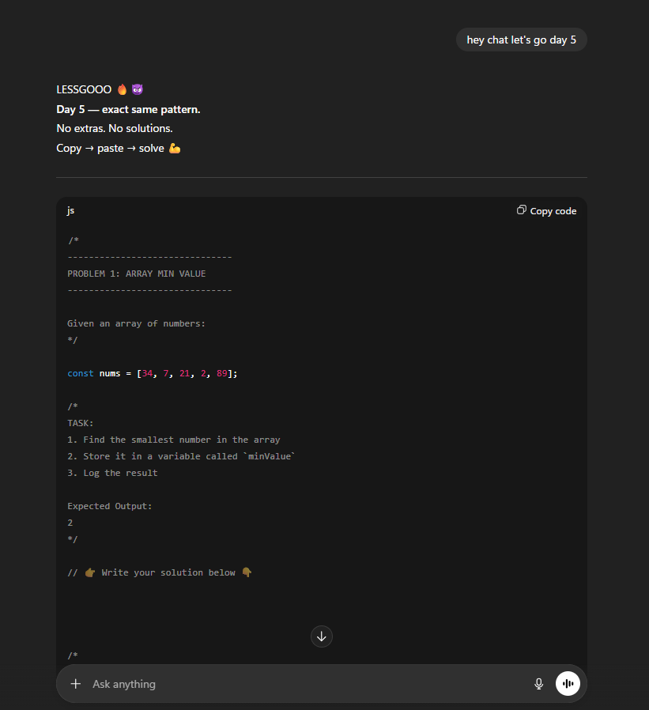

# Saving the Streak 🔥

This repository exists for **one simple reason**:  
to protect my daily coding consistency during a **chaotic academic phase**.

 

| One command → full problem in seconds. Time saved = consistency protected. |
| :---: |
|  |
| *Example of how a daily problem is generated in seconds — so I can spend time solving, not planning.* |

 

## Why this repo exists

I am currently going through:

- Semester exams
- Multiple subjects and backlogs
- High mental load and limited time

Completely stopping development during this phase would break momentum,  
so instead of doing _more_, I chose to do **less — but daily**.

## The Rule

- ⏱️ **15–20 minutes of JavaScript practice**
- 📌 **Very easy problems only** (arrays, strings, basics)
- ❌ No new concepts
- ❌ No big projects
- ❌ No overthinking

Just one small step every day.

## What you will find here

- Simple JS practice files
- One commit per day (most days)
- No guarantee of clean structure or perfection

This is **maintenance mode**, not growth mode.

## Philosophy

> Consistency beats intensity when life gets heavy.

This repo is not about showing skill.  
It’s about **showing up**.

---

🟢 Once exams end, normal development continues elsewhere.  
This repo will remain as proof that the streak was **saved, not sacrificed**.
