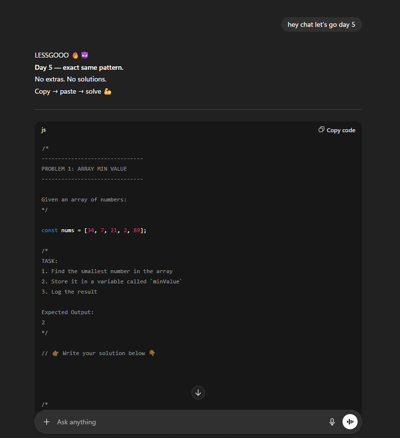

# Saving the Streak 🔥

A small JavaScript practice repository created to **protect daily coding consistency during exams** and now used to **refine solutions with built-in methods and GitHub workflow practice**.

### 📢 Current Update (Post-Exams Phase)

The exam phase ended with this repository reaching **Day 57** of the streak.

Now instead of adding new problems, I’m **revisiting the same problems starting from Day 1** — but with a different goal.

#### Phase 2 focus:

- ⚡ Solve problems using **JavaScript built-in methods**
- 🧠 Write **cleaner and more modern JS**
- 🛠 Practice **real GitHub workflow**
- 🔁 Reinforce fundamentals by **re-solving existing problems**

```
Issue → Branch → Solve → Commit → Pull Request → Merge
```

#### Each file now contains **two solutions**:

- the **original solution (without built-ins)** from the exam phase
- a **new solution using built-in methods**

So the problems stay the same, but the **approach evolves**.

This repository is now both:

- a **JavaScript practice log**
- a **Git/GitHub workflow playground**

> **⭐ Consistency first. Optimization later.**

---

# Original Purpose of the Repository 🎓

This repository exists for **one simple reason**:  
to protect my daily coding consistency during a **chaotic academic phase**.

<br>

|              One command → full problem in seconds. Time saved = consistency protected.               |
| :---------------------------------------------------------------------------------------------------: |
|             |
| _Example of how a daily problem is generated in seconds — so I can spend time solving, not planning._ |

<br>

## Why this repo exists

I am currently going through:

- Semester exams
- Multiple subjects and backlogs
- High mental load and limited time

Completely stopping development during this phase would break momentum,  
so instead of doing _more_, I chose to do **less — but daily**.

## The Rule

- ⏱️ **15–20 minutes of JavaScript practice**
- 📌 **Very easy problems only** (arrays, strings, basics)
- ❌ No new concepts
- ❌ No big projects
- ❌ No overthinking

Just one small step every day.

## What you will find here

- Simple JS practice files
- One commit per day (most days)
- No guarantee of clean structure or perfection

This is **maintenance mode**, not growth mode.

## Philosophy

> Consistency beats intensity when life gets heavy.

This repo is not about showing skill.  
It’s about **showing up**.

---

🟢 Once exams end, normal development continues elsewhere.  
This repo will remain as proof that the streak was **saved, not sacrificed**.
