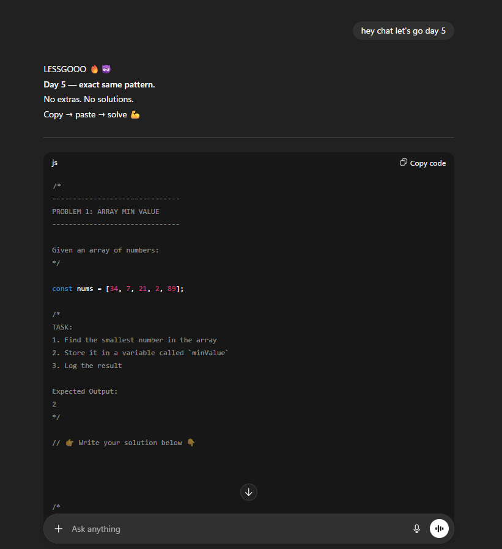

# Saving the Streak 🔥

A small JavaScript practice repository created to **protect daily coding consistency during busy academic periods**.

The goal isn't to solve difficult problems—it's to **keep the habit alive** with small, enjoyable JavaScript exercises that can be completed in **15–20 minutes**.

Sometimes this repository contains new problems, sometimes I revisit old ones, and sometimes I experiment with different JavaScript approaches. The exact content may change, but the purpose stays the same:

> **Keep the streak alive.**

---

## ⚡ How I Keep It Fast

|              One command → full problem in seconds. Time saved = consistency protected.               |
| :---------------------------------------------------------------------------------------------------: |
|              |
| _Example of how a daily problem is generated in seconds — so I can spend time solving, not planning._ |

---

## Why this repository exists 🎓

During exams and other busy periods, spending hours on development isn't always realistic.

Instead of stopping completely, I use this repository to solve one small JavaScript problem each day.

This helps me:

- ⚡ Stay consistent
- 🧠 Practice JavaScript fundamentals
- 😊 Keep coding fun, even during exams
- ⏱️ Save time while maintaining the habit

---

## How it works

- ⏱️ Short daily problems (around 15–20 minutes)
- 📌 Focus on JavaScript fundamentals
- 💡 Sometimes revisit old problems with a different approach
- 🛠️ Occasionally practice Git & GitHub workflow alongside coding

```
Issue → Branch → Solve → Commit → Pull Request → Merge
```

Every problem is intentionally small so consistency is never sacrificed.

---

## What you'll find here

- JavaScript practice problems
- Different approaches to solving the same problem
- Small experiments with modern JavaScript
- A history of consistent daily coding

---

## Philosophy

> Consistency beats intensity.

This repository isn't about solving the hardest problems.

It's about showing up, even on the busiest days.

Because a small step every day is better than stopping completely.
